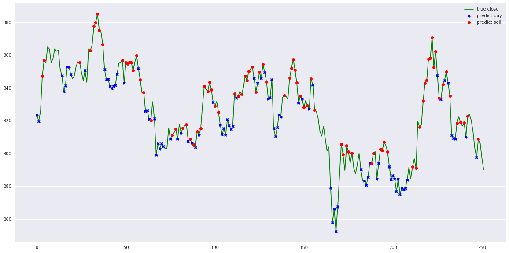

    

  
  
  

---

**Stock-Prediction-Models**, Gathers machine learning and deep learning models for Stock forecasting, included trading bots and simulations.

## Table of contents
  * [Models](#models)
  * [Agents](#agents)
  * [Realtime Agent](realtime-agent)
  * [Data Explorations](#data-explorations)
  * [Simulations](#simulations)
  * [Tensorflow-js](#tensorflow-js)
  * [Misc](#misc)
  * [Results](#results)
    * [Results Agent](#results-agent)
    * [Results signal prediction](#results-signal-prediction)
    * [Results analysis](#results-analysis)
    * [Results simulation](#results-simulation)

## Contents

### Models

#### [Deep-learning models](deep-learning)
 1. LSTM
 2. LSTM Bidirectional
 3. LSTM 2-Path
 4. GRU
 5. GRU Bidirectional
 6. GRU 2-Path
 7. Vanilla
 8. Vanilla Bidirectional
 9. Vanilla 2-Path
 10. LSTM Seq2seq
 11. LSTM Bidirectional Seq2seq
 12. LSTM Seq2seq VAE
 13. GRU Seq2seq
 14. GRU Bidirectional Seq2seq
 15. GRU Seq2seq VAE
 16. Attention-is-all-you-Need
 17. CNN-Seq2seq
 18. Dilated-CNN-Seq2seq

**Bonus**

1. How to use one of the model to forecast `t + N`, [how-to-forecast.ipynb](deep-learning/how-to-forecast.ipynb)
2. Consensus, how to use sentiment data to forecast `t + N`, [sentiment-consensus.ipynb](deep-learning/sentiment-consensus.ipynb)

#### [Stacking models](stacking)
 1. Deep Feed-forward Auto-Encoder Neural Network to reduce dimension + Deep Recurrent Neural Network + ARIMA + Extreme Boosting Gradient Regressor
 2. Adaboost + Bagging + Extra Trees + Gradient Boosting + Random Forest + XGB

### [Agents](agent)

1. Turtle-trading agent
2. Moving-average agent
3. Signal rolling agent
4. Policy-gradient agent
5. Q-learning agent
6. Evolution-strategy agent
7. Double Q-learning agent
8. Recurrent Q-learning agent
9. Double Recurrent Q-learning agent
10. Duel Q-learning agent
11. Double Duel Q-learning agent
12. Duel Recurrent Q-learning agent
13. Double Duel Recurrent Q-learning agent
14. Actor-critic agent
15. Actor-critic Duel agent
16. Actor-critic Recurrent agent
17. Actor-critic Duel Recurrent agent
18. Curiosity Q-learning agent
19. Recurrent Curiosity Q-learning agent
20. Duel Curiosity Q-learning agent
21. Neuro-evolution agent
22. Neuro-evolution with Novelty search agent
23. ABCD strategy agent

### [Data Explorations](misc)

1. stock market study on TESLA stock, [tesla-study.ipynb](misc/tesla-study.ipynb)
2. Outliers study using K-means, SVM, and Gaussian on TESLA stock, [outliers.ipynb](misc/outliers.ipynb)
3. Overbought-Oversold study on TESLA stock, [overbought-oversold.ipynb](misc/overbought-oversold.ipynb)
4. Which stock you need to buy? [which-stock.ipynb](misc/which-stock.ipynb)

### [Simulations](simulation)

1. Simple Monte Carlo, [monte-carlo-drift.ipynb](simulation/monte-carlo-drift.ipynb)
2. Dynamic volatility Monte Carlo, [monte-carlo-dynamic-volatility.ipynb](simulation/monte-carlo-dynamic-volatility.ipynb)
3. Drift Monte Carlo, [monte-carlo-drift.ipynb](simulation/monte-carlo-drift.ipynb)
4. Multivariate Drift Monte Carlo BTC/USDT with Bitcurate sentiment, [multivariate-drift-monte-carlo.ipynb](simulation/multivariate-drift-monte-carlo.ipynb)
5. Portfolio optimization, [portfolio-optimization.ipynb](simulation/portfolio-optimization.ipynb), inspired from https://pythonforfinance.net/2017/01/21/investment-portfolio-optimisation-with-python/

### [Tensorflow-js](stock-forecasting-js)

I code [LSTM Recurrent Neural Network](deep-learning/1.lstm.ipynb) and [Simple signal rolling agent](agent/simple-agent.ipynb) inside Tensorflow JS, you can try it here, [huseinhouse.com/stock-forecasting-js](https://huseinhouse.com/stock-forecasting-js/), you can download any historical CSV and upload dynamically.

### [Misc](misc)

1. fashion trending prediction with cross-validation, [fashion-forecasting.ipynb](misc/fashion-forecasting.ipynb)
2. Bitcoin analysis with LSTM prediction, [bitcoin-analysis-lstm.ipynb](misc/bitcoin-analysis-lstm.ipynb)
3. Kijang Emas Bank Negara, [kijang-emas-bank-negara.ipynb](misc/kijang-emas-bank-negara.ipynb)
